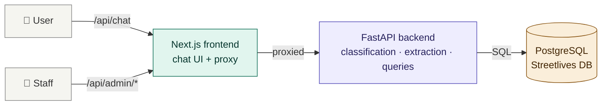
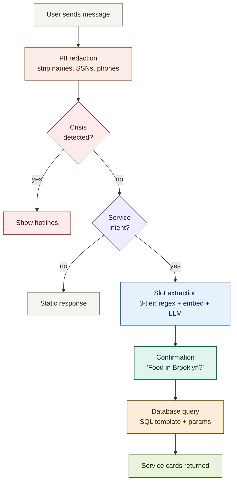
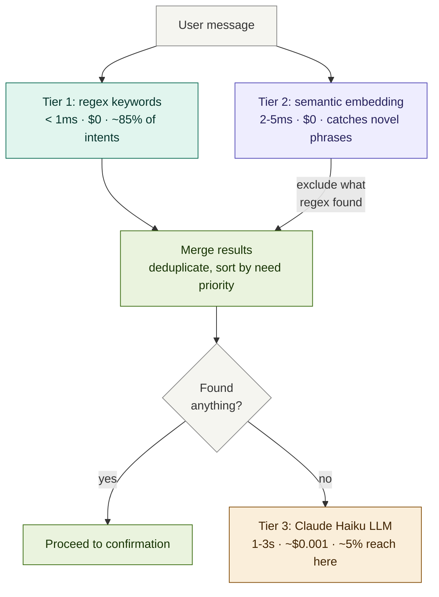
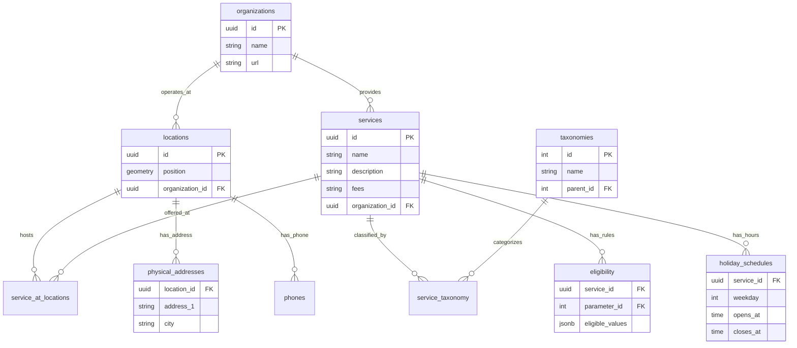

# YourPeer Chatbot — Engineering Onboarding Guide

Welcome to the YourPeer chatbot project. This guide walks you through the codebase from the top down, starting with what the system does, then how it's built, and finally where to go when you need to change something specific. It's written for someone who may not have worked with chatbots, NLP, or social services software before.

Take your time with this. The codebase has a lot of moving parts, but each one exists for a clear reason. If something doesn't make sense, check the linked file — the code comments explain the "why" behind most decisions.

---

## 1. What This Project Is

YourPeer is a website (yourpeer.nyc) that helps people experiencing homelessness in New York City find free services — food, shelter, showers, clothing, health care, legal help, and more. The chatbot is a conversational interface that sits in front of YourPeer's service database. Instead of browsing categories on a website, users describe what they need in plain language, and the chatbot finds matching services.

The data comes from Streetlives, a nonprofit whose team includes people with lived experience of homelessness. They physically visit service locations, verify hours and availability, and update the database. This matters for engineering decisions — the data is human-curated and imperfect, not scraped or auto-generated.

The users are people in crisis. They may be typing on a shared public library computer, a cracked phone with a dying battery, or a borrowed device. They may be scared, exhausted, or ashamed. Some have low literacy. Some speak Spanish. Some use NYC youth slang. The technical choices in this codebase — from how the bot talks, to what it shows on error, to how it handles privacy — are shaped by this context.

---

## 2. The One Rule That Governs Everything

**The LLM never generates service information.** Every address, phone number, set of hours, and eligibility rule comes from the Streetlives database via a pre-written SQL query. The AI only handles conversation — understanding what the user needs and where they are. This is called **Safer, Limited RAG** (Retrieval-Augmented Generation), and it exists because a hallucinated shelter address for someone sleeping outside tonight is dangerous.

If you remember one thing from this guide, make it this. When you see code that seems overly cautious about keeping the LLM away from service data, that's why.

→ `backend/app/services/responses.py` — the LLM system prompts that enforce this boundary
→ `docs/CHATBOT_BEHAVIOR.md` — full explanation of the safety architecture

---

## 3. High-Level Architecture

The system is two applications talking to each other, plus an external database they both ultimately serve.

**Frontend** — a Next.js 15 web application (React 19, TypeScript, Tailwind CSS). Serves the chat interface at `/chat` and a staff review console at `/admin`. Deployed as its own service on Render.

**Backend** — a Python FastAPI server. Handles all the intelligence: understanding the user's message, querying the database, formatting results. Also serves the admin API. Deployed as a separate service on Render.

**Database** — a PostgreSQL database on AWS RDS, owned and maintained by Streetlives. The chatbot has read-only access. It's the same database that powers the yourpeer.nyc website.

The frontend and backend are in a single repository (monorepo) but deploy independently. The frontend proxies API calls to the backend — the browser never talks to the backend directly. This keeps the backend URL and admin API key hidden from users.

→ `frontend-next/src/app/api/` — the Next.js proxy routes
→ `backend/app/main.py` — the FastAPI application entry point

---

## 4. What Happens When a User Sends a Message

This is the core flow. Every feature in the codebase plugs into one of these steps.

### Step 1: Frontend sends the message

The user types "I need food in Brooklyn" and taps send. The React chat component calls `sendChatMessage()`, which POSTs to `/api/chat`. The Next.js proxy forwards it to the FastAPI backend. If the browser has GPS coordinates (from a previous "Use my location" tap), those travel along with the message.

→ `frontend-next/src/hooks/use-chat.ts` — the `send()` function
→ `frontend-next/src/lib/chat/api.ts` — the HTTP call
→ `frontend-next/src/app/api/chat/route.ts` — the Next.js proxy

### Step 2: Backend receives and classifies

The backend's `generate_reply()` function is the main entry point. It does several things in order:

**PII redaction** — before anything else, personal information (phone numbers, SSNs, names, emails) is detected and stripped from the message. The original message is used for processing, but only the redacted version is ever stored.

**Crisis detection** — the system checks if the user is in danger (suicidal, fleeing violence, trafficking, medical emergency). This runs on every message, before all other logic. If a crisis is detected, hotline resources are shown immediately.

**Message classification** — the system figures out what kind of message this is. Is the user requesting a service? Saying hello? Expressing frustration? Asking what the bot can do? Each type routes to a different handler.

**Slot extraction** — if the message is a service request, the system extracts structured "slots" from the natural language: what service they need (food), where they are (Brooklyn), their age, family status, and other details. This is where the 3-Tier system lives (explained in Section 5).

**Confirmation** — once the system has enough information, it summarizes what it understood and asks the user to confirm before searching: "I'll look for food in Brooklyn — does that sound right?"

**Database query** — after confirmation, a pre-written SQL template runs against the Streetlives database with the extracted parameters.

**Result rendering** — matching services are formatted as interactive cards with addresses, hours, phone numbers, and action buttons. No LLM involvement in this step — it's pure data formatting.

→ `backend/app/services/chatbot.py` — the main `generate_reply()` function (~2,500 lines, the largest file)
→ `backend/app/routes/chat.py` — the HTTP endpoint that calls `generate_reply()`

### Step 3: Frontend renders the response

The backend returns a JSON object with a text response, optional service cards, and optional quick-reply buttons. The frontend renders these as chat bubbles, interactive service cards, and tappable buttons.

→ `frontend-next/src/components/chat/chat-message.tsx` — renders bot messages
→ `frontend-next/src/components/chat/service-card.tsx` — renders service cards
→ `frontend-next/src/components/chat/quick-replies.tsx` — renders quick-reply buttons
→ `frontend-next/src/lib/chat/types.ts` — TypeScript interfaces for all response shapes

---

## 5. The 3-Tier Classification System

This is the most important architectural concept in the backend. When a user says "I need food in Brooklyn," the system needs to extract two things: service type ("food") and location ("Brooklyn"). The 3-Tier system is how it figures out the service type.

### Tier 1: Regex keyword matching

The system scans the message for known keywords. "food" is in a list of food-related keywords. "shelter" is in a shelter list. And so on for 10 service categories. This is fast (under 1 millisecond), free, and handles about 85% of service intents.

The limitation: it only works when the user uses a word that's literally in the keyword list. "I need food" works. "I'm hungry" doesn't — "hungry" isn't a keyword.

→ `backend/app/services/slot_extractor.py` — keyword lists and extraction logic

### Tier 2: Semantic embedding

A small AI model called `all-MiniLM-L6-v2` runs locally on the server (no API call, no cost). This model converts the user's message into a mathematical vector (a list of 384 numbers) that represents its meaning. It then compares this vector against pre-computed vectors for example phrases like "I'm starving", "I ran out of insulin", "felon looking for work". If the user's message is semantically similar to a known phrase, the system identifies the service type.

**What "semantic embedding" means in plain terms:** imagine every possible sentence plotted as a point in space. Sentences with similar meanings end up near each other. "I need food" and "I'm hungry" are far apart in spelling but close in meaning-space. The model converts text to coordinates in this meaning-space, and the system finds which service category's example phrases are closest.

→ `backend/app/services/semantic_router.py` — the embedding and matching logic
→ `backend/app/services/semantic_routes.py` — the example phrases for each category
→ `docs/design/SEMANTIC_ROUTING_DESIGN.md` — design rationale and how to add routes

### How Tiers 1 and 2 work together

Tiers 1 and 2 both run on every message — they're complementary, not sequential. Regex catches exact keyword matches, while the semantic router catches novel phrasings that regex misses. The results are merged and deduplicated. This is critical for multi-intent extraction: when a user says "I just got out of Rikers and I don't have anywhere to sleep or anything to eat," regex catches "eat" → food, while the semantic router catches "anywhere to sleep" → shelter. Neither tier alone would find both.

The semantic router uses an `exclude` parameter to skip service categories that regex already found, avoiding duplicate work. After merging, services are sorted by need-based priority (shelter before food, medical before clothing), not by which tier found them.

### Tier 3: LLM classification

When both Tiers 1 and 2 find nothing — no service keyword, no semantic match, no action, no tone — the system calls Claude Haiku (Anthropic's fastest model) with the message. Haiku returns structured JSON with the service type, location, and other slots. About 5% of messages reach this tier — the ones where natural language is genuinely ambiguous or complex.

This costs money per call and adds 1-3 seconds of latency, which is why it's the last resort rather than the first step.

→ `backend/app/llm/claude_client.py` — the Anthropic API client
→ `backend/app/services/llm_classifier.py` — the unified LLM classification gate

### Why three tiers?

Cost and speed. If every message went to the LLM, the system would cost ~$0.01 per message and take 1-3 seconds. With Tiers 1 and 2 handling ~95% of messages in under 5ms at zero cost, the LLM is reserved for the genuinely hard cases.

---

## 6. Key Concepts and Terms

These terms appear throughout the codebase and documentation. If you're not familiar with them, read this section before diving into code.

**Slot** — a structured piece of information extracted from the user's message. The main slots are `service_type` (what they need), `location` (where they are), `age`, `gender`, `family_status`, and `urgency`. The process of extracting these from natural language is called "slot filling" or "slot extraction." The term comes from conversational AI — think of it like filling in form fields from a conversation.

**Session** — a single conversation between a user and the bot. Sessions are anonymous (no login, no cookies), identified only by a random token. Session state (the extracted slots, conversation context, last action) lives in memory and optionally persists to SQLite. Sessions expire after 30 minutes.

**Quick replies** — tappable buttons shown below bot messages. When the bot asks "What borough are you in?", it shows buttons for Manhattan, Brooklyn, Queens, Bronx, and Staten Island. Tapping a button sends the button's value as the user's next message. This reduces typing, especially on mobile.

**Service card** — the formatted display of a service result. Each card shows the organization name, address, hours, phone number, and action buttons (Call, Directions, Website). Cards are never generated by the LLM — they're assembled from database fields by `format_service_card()`.

**Confirmation step** — before searching the database, the bot always confirms what it understood: "I'll look for food in Brooklyn — does that sound right?" This prevents wasted searches and gives the user a chance to correct mistakes.

**Relaxed query** — when a strict database query returns zero results, the system automatically loosens the filters (drops age/gender requirements, widens the geographic area) and tries again. The user sees "(I broadened the search a bit)" when this happens.

**PII** — personally identifiable information. Phone numbers, Social Security numbers, names, email addresses. The system detects and redacts these from stored transcripts. The user's message is processed with the original text (so "Call me at 212-555-1234" correctly extracts the phone number), but only the redacted version ("[PHONE]") is saved to the audit log.

**Crisis step-down** — when the bot detects a crisis (e.g., domestic violence) alongside a service request (e.g., shelter), it shows crisis resources (hotlines) AND offers to search for the service. "Step-down" means transitioning from crisis response back to the normal service flow without losing the user's original request.

**AVR pattern** — Acknowledge, Validate, Redirect. A clinical chatbot design pattern (from Woebot and Wysa research) for handling emotional messages. The bot acknowledges the feeling ("I hear you"), validates it ("that's completely understandable"), then gently offers a path forward ("when you're ready, I can help"). This replaces the instinct to jump straight to solutions.

**SAMHSA** — the Substance Abuse and Mental Health Services Administration. Their six principles of trauma-informed care (Safety, Trustworthiness, Peer Support, Collaboration, Empowerment, Cultural Awareness) guide the chatbot's tone and design. You'll see SAMHSA referenced in code comments explaining why certain messages are worded the way they are.

**PostGIS** — an extension for PostgreSQL that adds geographic capabilities. The Streetlives database stores each location's coordinates as a PostGIS `geometry` column. When a user shares their browser GPS location, the system uses PostGIS functions like `ST_DWithin()` to find services within a radius. PostGIS queries can be slow without proper indexing — the codebase uses bounding box pre-filters to keep them fast.

**RAG** — Retrieval-Augmented Generation. A pattern where an AI model retrieves information from a database and then generates a response based on it. Traditional RAG has hallucination risks because the LLM synthesizes the retrieved text. YourPeer uses "Safer, Limited RAG" where the LLM only handles conversation and the database results are displayed as-is, never synthesized.

---

## 7. The Database: How Streetlives Structures Their Data

Understanding the database schema is essential because every service search ends up as a SQL query against it. The database is a standard relational PostgreSQL database with PostGIS for geographic queries.

The core relationship is: **organizations** operate at **locations**, where they provide **services**, which are classified by **taxonomies**. A single location (like "Catholic Worker in East Village") can have multiple services (food, clothing, shower). A single organization (like "Safe Horizon") can have multiple locations across the city.

The key tables are:

**`services`** (3,506 rows) — individual service offerings. Each has a name, description, fees, and belongs to an organization.

**`locations`** (2,414 rows) — physical places. Each has a PostGIS `position` column for GPS coordinates and belongs to an organization.

**`service_at_locations`** (3,405 rows) — the junction table connecting services to locations. This is how the system knows "this food service is offered at this location."

**`taxonomies`** (39 rows) — the category tree. "Food" is a taxonomy. "Soup Kitchen" and "Food Pantry" are child taxonomies under "Food." The chatbot maps the user's service type to one or more taxonomy names and filters by them.

**`physical_addresses`** (2,569 rows) — street addresses for locations. Importantly, there is no "borough" column anywhere in the database. The city field (e.g., "Manhattan", "Brooklyn") serves as the borough identifier.

**`eligibility`** (3,646 rows) — eligibility rules stored as JSONB. A service might have an age rule like `{"min": 18, "max": 25}` or a gender rule like `["Female"]`. The chatbot uses these to filter results when the user provides their age or gender.

**`holiday_schedules`** (10,593 rows) — current operating hours. Despite the name "holiday," these are the actively maintained schedules (labeled "COVID19" in the data). The `regular_schedules` table exists but is stale (pre-COVID).

There are several gotchas that have tripped up engineers before: there is no "type" column on services (you must join through the taxonomy tables), the junction table is called `service_at_locations` with an "s" (not `service_at_location`), and eligibility values are JSONB that varies in shape by parameter.

→ `backend/app/rag/query_templates.py` — the SQL templates and full schema documentation in the file header
→ `docs/ops/METRICS.md` — database coverage statistics (schedule data, taxonomy distribution)

---

## 8. The Backend in Detail

The backend is organized into four packages under `backend/app/`:

### `services/` — the brain

This is where most of the chatbot logic lives.

**`chatbot.py`** is the largest file (~2,500 lines) and the main router. It receives a message, decides what to do with it, and returns a response. If you're tracing a bug, start here — every conversation turn flows through `generate_reply()`. The file is long because each message type (service request, greeting, frustration, crisis, confirmation, post-results question) has its own handler with specific quick replies and context-aware logic.

**`slot_extractor.py`** handles Tier 1 extraction — the regex keyword matching. It contains the `SERVICE_KEYWORDS` dictionary (10 categories of keywords), location parsing (59 NYC neighborhoods, 5 boroughs, 200+ zip codes), and multi-intent extraction (finding all services in a message, not just the first one).

**`semantic_router.py`** handles Tier 2 — the sentence embedding model. It loads `all-MiniLM-L6-v2`, pre-embeds all the example phrases from `semantic_routes.py` at startup, and provides `classify_all_services()` for multi-intent matching.

**`classifier.py`** handles message classification — is this a greeting, a reset, a confirmation, frustration, a bot question? It uses phrase lists from `phrase_lists.py` with contraction normalization and intensifier stripping.

**`crisis_detector.py`** detects seven categories of crisis (suicide, DV, trafficking, medical emergency, youth runaway, assault, general safety) using regex patterns, with an optional LLM fallback for indirect language.

**`responses.py`** contains all hardcoded bot messages (greetings, emotional responses, crisis responses, warmth prefixes) and the LLM prompt builders.

**`confirmation.py`** builds the confirmation message ("I'll look for food in Brooklyn") and the no-results fallback message.

**`post_results.py`** handles follow-up questions after results are displayed — "are any open now?", "tell me about the first one", "only the pantries."

**`session_store.py`** manages in-memory session state (extracted slots, conversation context, results).

### `rag/` — the database layer

**`query_templates.py`** is the second most important file. It contains every SQL query the system can run, as parameterized templates. Each service category (food, shelter, clothing, etc.) has a template that specifies which taxonomy names to filter by, which optional filters to apply (age, gender, proximity, accessibility), and how to sort results. When the architecture docs say "no LLM-generated SQL," this is what they mean — every query is pre-written here.

**`query_executor.py`** runs the SQL templates against the database. It handles connection pooling, timeout detection, the relaxed-query fallback, and result formatting.

**`__init__.py`** (the `rag` package init) provides `query_services()`, which is the main entry point from the chatbot. It maps slot values to template parameters and calls the executor.

### `llm/` — the AI models

**`claude_client.py`** manages the Anthropic API client. It defines which Claude model is used for each task (Haiku for conversation and classification, Sonnet for crisis detection), provides `claude_reply()` for conversational responses, `classify_message_llm()` for the unified classification gate, and `ping_llm()` for health checking.

### `routes/` — the HTTP endpoints

**`chat.py`** — the `/chat/` endpoint. Validates the request, calls `generate_reply()`, returns the response.

**`admin.py`** — all admin API endpoints. Stats, conversations, events, query logs, eval results, eval runner, and eval upload.

### `privacy/` — PII handling

**`pii_redactor.py`** — regex-based detection and redaction of phone numbers, SSNs, names, emails, and other PII. Applied to every message before it's stored.

---

## 9. The Frontend in Detail

The frontend is a Next.js 15 App Router application with two main sections.

### Chat interface (`/chat`)

The chat is built from a small set of React components:

**`chat-container.tsx`** — the top-level layout. Manages the connection status indicator (green/amber/red dot), the status banner for degraded/offline states, and scrolling behavior.

**`chat-message.tsx`** — renders individual messages (user and bot). Bot messages can contain plain text, service cards, and quick reply buttons.

**`service-card.tsx`** — the most complex chat component. Renders each service result as a card with organization name, address, hours, open/closed badge, action buttons (Call, Directions, Website), and a collapsible details section. The "Call" button shows a confirmation dialog before opening the phone dialer.

**`quick-replies.tsx`** — renders tappable buttons below bot messages. Handles both text buttons (that send a message) and link buttons (like `tel:` links for phone calls).

**`chat-input.tsx`** — the text input area with send button and optional voice input.

### Hooks (in `hooks/`)

React hooks manage side effects and shared state:

**`use-chat.ts`** — the main chat hook. Manages message history, sending messages (with auto-retry), handling geolocation triggers, crisis geolocation flow, error classification, and feedback submission. This is the chat-side equivalent of `chatbot.py` — if something isn't working in the chat UX, start here.

**`use-geolocation.ts`** — wraps the browser's Geolocation API with error handling and permission management.

**`use-backend-health.ts`** — polls `/api/health` every 60 seconds and derives the connection state (connected, degraded, unreachable) with detail strings for tooltips.

**`use-online-status.ts`** — tracks browser online/offline events.

### State management

The app uses **Zustand** for client-side state (a simpler alternative to Redux). The chat store persists message history and session ID to localStorage so conversations survive page refreshes.

→ `frontend-next/src/lib/chat/store.ts` — the Zustand store

### Admin console (`/admin`)

The admin section is a separate set of pages behind an API key. Staff can view anonymized conversation transcripts, query logs, crisis events, system health, evaluation results, and cost analysis. The admin pages share a Zustand store with 30-second staleness caching to avoid redundant API calls.

All admin API calls go through a catch-all proxy route (`app/api/admin/[...slug]/route.ts`) that forwards requests to the backend and injects the admin API key server-side. This means the admin key never reaches the browser.

→ `frontend-next/src/app/admin/` — the admin page components
→ `frontend-next/src/components/admin/` — reusable admin UI components
→ `frontend-next/src/lib/admin/store.ts` — the admin Zustand store

---

## 10. Common Design Patterns in the Codebase

**Extract-first architecture** — slots are always extracted from the message before the message is classified. This means service intent is known before routing decisions are made. You'll see `extract_slots(message)` called early in `generate_reply()`, followed by classification logic that uses the extracted slots.

**Static-first responses** — the bot prefers hardcoded responses over LLM-generated ones. Emotional responses, crisis responses, greetings, and help messages are all static strings. The LLM is only called when no static handler matches. This keeps responses predictable, fast, and auditable.

**Quick replies as state machines** — after each bot response, the quick reply buttons define the valid next actions. After a confirmation, buttons are "Yes, search / Change location / Change service / Start over." After crisis resources, buttons are "Yes, search for shelter / Peer navigator." The `_last_action` field in the session tracks which handler should process the next "yes" or "no."

**Fail-open for safety** — if the crisis detection LLM call fails, the system shows safety resources anyway rather than falling through to normal conversation. Missing a crisis is more dangerous than a false alarm.

**Fail-closed for data** — if the database query fails, the system shows a specific error message (not an LLM-generated one) and never fabricates service data. The LLM is explicitly blocked from generating responses during database failures because it produces plausible-sounding follow-up questions that trap users in confirmation loops.

---

## 11. How to Dig Deeper

Once you're comfortable with the architecture, these documents cover specific areas in depth.

| Area | Document | What it covers |
|---|---|---|
| Full feature list | `docs/FEATURES.md` | Every feature organized by area — conversation, crisis, search, cards, privacy, accessibility, staff tools |
| Chatbot behavior | `docs/CHATBOT_BEHAVIOR.md` | Routing pipeline, message categories, emotional handling, crisis step-down, LLM usage, guardrails |
| Crisis detection | `docs/design/CRISIS_DETECTION.md` | Two-stage architecture, 7 crisis categories, fail-open policy, phrase list design |
| PII handling | `docs/design/PII_REDACTION.md` | Seven detection categories, pattern details, known gaps |
| Semantic routing | `docs/design/SEMANTIC_ROUTING_DESIGN.md` | Model selection, 3-tier cascade, route definitions, how to add new routes |
| Multi-intent design | `docs/audits/MULTI_INTENT_PLAN.md` | How multiple services in one message are extracted, prioritized, and queued |
| Evaluation framework | `docs/ops/EVAL_RESULTS.md` | LLM-as-judge system, 11 scoring dimensions, run history |
| Regex keyword audit | `docs/audits/REGEX_AUDIT.md` | Collision risk analysis, word boundary decisions |
| Metrics | `docs/ops/METRICS.md` | 35+ success metrics with definitions, targets, and measurement methods |
| Hardcoded messages | `docs/audits/HARDCODED_MESSAGES_REVIEW.md` | Every user-facing hardcoded message with trigger conditions and source locations |
| Test suite | `docs/TESTING.md` | 2,000+ tests across 46 files — how they're organized, how to run them, where to add new ones |
| Setup | `docs/SETUP.md` | Local development setup, environment variables, dependencies |
| Deployment | `docs/DEPLOY.md` | Render deployment, environment variables, build commands |
| Test file index | `tests/tests/README.md` | Maps every source module to its test file(s) |

---

## 12. Your First Week Checklist

Here's a suggested order for getting oriented:

**Day 1 — Get it running.** Follow `docs/SETUP.md` to set up the backend and frontend locally. Send a few messages in the chat. Try "I need food in Brooklyn", "shelter in Queens", "start over", and "what can you do?" Watch the terminal logs to see the classification tier, slot extraction, and query execution.

**Day 2 — Read the main flow.** Open `backend/app/services/chatbot.py` and read `generate_reply()` from top to bottom. Don't try to understand every handler — just follow the main path for a simple "I need food in Brooklyn" message. Trace it through slot extraction, confirmation, query execution, and result rendering.

**Day 3 — Explore the database.** Open `backend/app/rag/query_templates.py` and read the schema documentation at the top. Then look at one template (like the `food` template) to see which tables it joins and which filters it applies. Try the admin console at `/admin` to see query logs and execution times.

**Day 4 — Understand the frontend.** Open the chat in your browser with DevTools Network tab open. Send a message and inspect the request/response. Then open `frontend-next/src/hooks/use-chat.ts` and trace how the response becomes chat messages. Look at `service-card.tsx` to see how service data renders.

**Day 5 — Run the tests.** Run `pytest tests/unit/ -v` from the `tests/` directory. Read `tests/tests/README.md` to understand the test organization. Try running a single test file. If you have an Anthropic API key, try running a single eval scenario: `python tests/eval/eval_llm_judge.py --scenarios 1`.

---

## 13. Common Tasks — Where to Look

| I want to... | Start here |
|---|---|
| Add a new service keyword | `backend/app/services/slot_extractor.py` → `SERVICE_KEYWORDS` dict |
| Add a new semantic route phrase | `backend/app/services/semantic_routes.py` → `SERVICE_ROUTES` dict |
| Change a bot response message | `backend/app/services/responses.py` (conversational) or `crisis_detector.py` (crisis) |
| Add a new crisis category | `backend/app/services/crisis_detector.py` → `_CRISIS_CATEGORIES` list |
| Change how results are sorted | `backend/app/rag/query_templates.py` → `_BASE_ORDER_PARTS` list |
| Add a new database filter | `backend/app/rag/query_templates.py` → add a `FILTER_BY_*` constant |
| Change the confirmation message | `backend/app/services/confirmation.py` → `_build_confirmation_message()` |
| Add a new admin metric | `frontend-next/src/lib/admin/metric-definitions.ts` + `backend/app/services/audit_log.py` |
| Add a new quick reply option | `backend/app/services/chatbot.py` → find the handler that should show it |
| Change the chat UI layout | `frontend-next/src/components/chat/chat-container.tsx` |
| Change service card appearance | `frontend-next/src/components/chat/service-card.tsx` |
| Add a test for a new feature | Check `tests/tests/README.md` for the right file, or create a new one |

---

## 14. Asking for Help

If you're stuck, check the docs list in Section 11 first — most design decisions are documented somewhere. The code comments in `chatbot.py`, `query_templates.py`, and `responses.py` are especially detailed about the "why" behind decisions.

If you're making a change and aren't sure if it's safe, look for related tests in `tests/tests/README.md`. The test suite has 2,000+ tests specifically because the codebase handles sensitive situations where regressions can cause real harm.

Welcome to the team.
