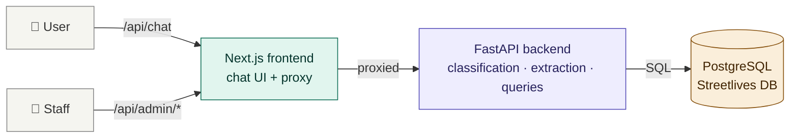
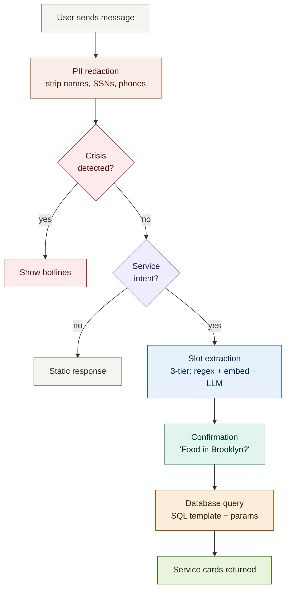
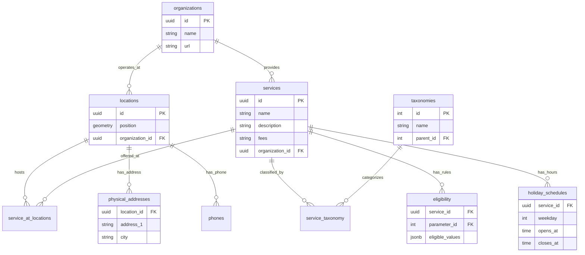

# YourPeer Chatbot — Engineering Onboarding Guide

Welcome to the YourPeer chatbot project. This guide walks you through the codebase from the top down, starting with what the system does, then how it's built, and finally where to go when you need to change something specific. It's written for someone who may not have worked with chatbots, NLP, or social services software before.

Take your time with this. The codebase has a lot of moving parts, but each one exists for a clear reason. If something doesn't make sense, check the linked file — the code comments explain the "why" behind most decisions.

---

## 1. What This Project Is

YourPeer is a website (yourpeer.nyc) that helps people experiencing homelessness in New York City find free services — food, shelter, showers, clothing, health care, legal help, and more. The chatbot is a conversational interface that sits in front of YourPeer's service database. Instead of browsing categories on a website, users describe what they need in plain language, and the chatbot finds matching services.

The data comes from Streetlives, a nonprofit whose team includes people with lived experience of homelessness. They physically visit service locations, verify hours and availability, and update the database. This matters for engineering decisions — the data is human-curated and imperfect, not scraped or auto-generated.

The users are people in crisis. They may be typing on a shared public library computer, a cracked phone with a dying battery, or a borrowed device. They may be scared, exhausted, or ashamed. Some have low literacy. Some speak Spanish. Some use NYC youth slang. The technical choices in this codebase — from how the bot talks, to what it shows on error, to how it handles privacy — are shaped by this context.

---

## 2. The One Rule That Governs Everything

**The LLM never generates service information.** Every address, phone number, set of hours, and eligibility rule comes from the Streetlives database via a pre-written SQL query. The AI only handles conversation — understanding what the user needs and where they are. This is called **Safer, Limited RAG** (Retrieval-Augmented Generation), and it exists because a hallucinated shelter address for someone sleeping outside tonight is dangerous.

If you remember one thing from this guide, make it this. When you see code that seems overly cautious about keeping the LLM away from service data, that's why.

→ `backend/app/services/responses.py` — the LLM system prompts that enforce this boundary
→ `docs/CHATBOT_BEHAVIOR.md` — full explanation of the safety architecture

---

## 3. High-Level Architecture

The system is two applications talking to each other, plus an external database they both ultimately serve.

**Frontend** — a Next.js 15 web application (React 19, TypeScript, Tailwind CSS). Serves the chat interface at `/chat` and a staff review console at `/admin`. Deployed as its own service on Render.

**Backend** — a Python FastAPI server. Handles all the intelligence: understanding the user's message, querying the database, formatting results. Also serves the admin API. Deployed as a separate service on Render.

**Database** — a PostgreSQL database on AWS RDS, owned and maintained by Streetlives. The chatbot has read-only access. It's the same database that powers the yourpeer.nyc website.

The frontend and backend are in a single repository (monorepo) but deploy independently. The frontend proxies API calls to the backend — the browser never talks to the backend directly. This keeps the backend URL and admin API key hidden from users.

→ `frontend-next/src/app/api/` — the Next.js proxy routes
→ `backend/app/main.py` — the FastAPI application entry point



---

## 4. What Happens When a User Sends a Message

This is the core flow. Every feature in the codebase plugs into one of these steps.

### Step 1: Frontend sends the message

The user types "I need food in Brooklyn" and taps send. The React chat component calls `sendChatMessage()`, which POSTs to `/api/chat`. The Next.js proxy forwards it to the FastAPI backend. If the browser has GPS coordinates (from a previous "Use my location" tap), those travel along with the message.

→ `frontend-next/src/hooks/use-chat.ts` — the `send()` function
→ `frontend-next/src/lib/chat/api.ts` — the HTTP call
→ `frontend-next/src/app/api/chat/route.ts` — the Next.js proxy

### Step 2: Backend receives and classifies

The backend's `generate_reply()` function is the main entry point. It does several things in order:

**PII redaction** — before anything else, personal information (phone numbers, SSNs, names, emails) is detected and stripped from the message. The original message is used for processing, but only the redacted version is ever stored. When the bot notices the user is about to share sensitive PII like an SSN, it proactively warns them instead of silently storing.

**Crisis detection** — the system checks if the user is in danger (suicidal, fleeing violence, trafficking, medical emergency). This runs on every message, before all other logic. If a crisis is detected, hotline resources are shown immediately.

**Message classification** — the system figures out what kind of message this is. Is the user requesting a service? Saying hello? Expressing frustration? Asking what the bot can do? Each type routes to a different handler.

**Slot extraction** — if the message is a service request, the system extracts structured "slots" from the natural language: what service they need (food), where they are (Brooklyn), their age, family status, and other details. This is where the 3-Tier system lives (explained in Section 5).

**Confirmation** — once the system has enough information, it summarizes what it understood and asks the user to confirm before searching: "I'll look for food in Brooklyn — does that sound right?"

**Database query** — after confirmation, a pre-written SQL template runs against the Streetlives database with the extracted parameters.

**Result rendering** — matching services are formatted as interactive cards with addresses, hours, phone numbers, and action buttons. No LLM involvement in this step — it's pure data formatting.

→ `backend/app/services/chatbot/orchestrator.py` — `generate_reply()` and the top-level dispatch
→ `backend/app/services/chatbot/` — the package of modules that implement each step (see Section 8)
→ `backend/app/routes/chat.py` — the HTTP endpoint that calls `generate_reply()`

### Step 3: Frontend renders the response

The backend returns a JSON object with a text response, optional service cards, and optional quick-reply buttons. The frontend renders these as chat bubbles, interactive service cards, and tappable buttons.

→ `frontend-next/src/components/chat/chat-message.tsx` — renders bot messages
→ `frontend-next/src/components/chat/service-card.tsx` — renders service cards
→ `frontend-next/src/components/chat/quick-replies.tsx` — renders quick-reply buttons
→ `frontend-next/src/lib/chat/types.ts` — TypeScript interfaces for all response shapes



---

## 5. The 3-Tier Classification System

This is the most important architectural concept in the backend. When a user says "I need food in Brooklyn," the system needs to extract two things: service type ("food") and location ("Brooklyn"). The 3-Tier system is how it figures out the service type.

### Tier 1: Regex keyword matching

The system scans the message for known keywords. "food" is in a list of food-related keywords. "shelter" is in a shelter list. And so on for **9 service categories** (`housing_assistance` was retired in the April 15 audit and folded into `other`). This is fast (under 1 millisecond), free, and handles about 85% of service intents.

The limitation: it only works when the user uses a word that's literally in the keyword list. "I need food" works. "I'm hungry" doesn't — "hungry" isn't a keyword.

→ `backend/app/services/slot_extractor.py` — keyword lists, extraction logic, and the `_SERVICE_NEED_PRIORITY` tier table (Housing First ordering — see Section 6)

### Tier 2: Semantic embedding

A small AI model called `all-MiniLM-L6-v2` runs locally on the server (no API call, no cost). This model converts the user's message into a mathematical vector (a list of 384 numbers) that represents its meaning. It then compares this vector against pre-computed vectors for example phrases like "I'm starving", "I ran out of insulin", "felon looking for work". If the user's message is semantically similar to a known phrase, the system identifies the service type.

**What "semantic embedding" means in plain terms:** imagine every possible sentence plotted as a point in space. Sentences with similar meanings end up near each other. "I need food" and "I'm hungry" are far apart in spelling but close in meaning-space. The model converts text to coordinates in this meaning-space, and the system finds which service category's example phrases are closest.

The model is pre-warmed at server startup (in `main.py`) so the first message after a cold start doesn't pay the loading cost.

→ `backend/app/services/semantic_router.py` — the embedding and matching logic
→ `backend/app/services/semantic_routes.py` — the example phrases for each category
→ `docs/design/SEMANTIC_ROUTING_DESIGN.md` — design rationale and how to add routes

### How Tiers 1 and 2 work together

Tiers 1 and 2 both run on every message — they're complementary, not sequential. Regex catches exact keyword matches, while the semantic router catches novel phrasings that regex misses. The results are merged and deduplicated. This is critical for multi-intent extraction: when a user says "I just got out of Rikers and I don't have anywhere to sleep or anything to eat," regex catches "eat" → food, while the semantic router catches "anywhere to sleep" → shelter. Neither tier alone would find both.

The semantic router uses an `exclude` parameter to skip service categories that regex already found, avoiding duplicate work. After merging, services are sorted by a **Housing-First need-based priority** (shelter/medical before food/mental_health before clothing/personal_care before legal/employment) — not by which tier found them, and not by mention order. See `_SERVICE_NEED_PRIORITY` in `slot_extractor.py`.

### Tier 3: LLM classification

When both Tiers 1 and 2 find nothing — no service keyword, no semantic match, no action, no tone — the system calls Claude Haiku (Anthropic's fastest model) with the message. Haiku returns structured JSON with the service type, location, and other slots. About 5% of messages reach this tier — the ones where natural language is genuinely ambiguous or complex.

This costs money per call and adds 1-3 seconds of latency, which is why it's the last resort rather than the first step.

→ `backend/app/llm/claude_client.py` — the Anthropic API client
→ `backend/app/services/llm_classifier.py` — the unified LLM classification gate
→ `backend/app/services/llm_slot_extractor.py` — LLM-based slot extraction via tool calling

### Why three tiers?

Cost and speed. If every message went to the LLM, the system would cost ~$0.01 per message and take 1-3 seconds. With Tiers 1 and 2 handling ~95% of messages in under 5ms at zero cost, the LLM is reserved for the genuinely hard cases.


---

## 6. Key Concepts and Terms

These terms appear throughout the codebase and documentation. If you're not familiar with them, read this section before diving into code.

**Slot** — a structured piece of information extracted from the user's message. The main slots are `service_type` (what they need), `location` (where they are), `age`, `gender`, `family_status`, and `urgency`. The process of extracting these from natural language is called "slot filling" or "slot extraction."

**Session** — a single conversation between a user and the bot. Sessions are anonymous (no login, no cookies), identified only by a random token. Session state (the extracted slots, conversation context, last action, last results, filter state) lives in memory and optionally persists to SQLite. Sessions expire after 30 minutes.

**Quick replies** — tappable buttons shown below bot messages. When the bot asks "What borough are you in?", it shows buttons for Manhattan, Brooklyn, Queens, Bronx, and Staten Island. Tapping a button sends the button's value as the user's next message. This reduces typing, especially on mobile.

**Service card** — the formatted display of a service result. Each card shows the organization name, address, hours, phone number, and action buttons (Call, Directions, Website). Cards are never generated by the LLM — they're assembled from database fields by `format_service_card()`. The card schema includes `latitude`/`longitude` for frontend map markers and `service_taxonomies` for sub-category filtering.

**Confirmation step** — before searching the database, the bot always confirms what it understood: "I'll look for food in Brooklyn — does that sound right?" This prevents wasted searches and gives the user a chance to correct mistakes.

**Relaxed query** — when a strict database query returns zero results, the system automatically loosens the filters (drops age/gender requirements, widens the geographic area) and tries again. The user sees "(I broadened the search a bit)" when this happens.

**PII** — personally identifiable information. Phone numbers, SSNs, names, emails, addresses, dates of birth, gender-identity terms. The system detects and redacts these from stored transcripts. The user's message is processed with the original text (so "Call me at 212-555-1234" correctly extracts the phone number), but only the redacted version ("[PHONE]") is saved. When sensitive PII like an SSN is detected, the bot warns the user proactively rather than silently storing.

**Crisis step-down** — when the bot detects a crisis (e.g., domestic violence) alongside a service request (e.g., shelter), it shows crisis resources (hotlines) AND offers to search for the service. "Step-down" means transitioning from crisis response back to the normal service flow without losing the user's original request.

**AVR pattern** — Acknowledge, Validate, Redirect. A clinical chatbot design pattern (from Woebot and Wysa research) for handling emotional messages. The bot acknowledges the feeling ("I hear you"), validates it ("that's completely understandable"), then gently offers a path forward ("when you're ready, I can help").

**SAMHSA** — the Substance Abuse and Mental Health Services Administration. Their six principles of trauma-informed care (Safety, Trustworthiness, Peer Support, Collaboration, Empowerment, Cultural Awareness) guide the chatbot's tone and design. You'll see SAMHSA referenced in code comments explaining why certain messages are worded the way they are.

**PostGIS** — an extension for PostgreSQL that adds geographic capabilities. The Streetlives database stores each location's coordinates as a PostGIS `geometry` column. When a user shares their browser GPS location, the system uses PostGIS functions like `ST_DWithin()` to find services within a radius. PostGIS queries can be slow without proper indexing — the codebase uses bounding box pre-filters to keep them fast.

**RAG** — Retrieval-Augmented Generation. YourPeer uses "Safer, Limited RAG" where the LLM only handles conversation and the database results are displayed as-is, never synthesized.

**Housing First priority** — a Housing-First-aligned service-need ranking in `_SERVICE_NEED_PRIORITY` that puts shelter and medical (tier 1) ahead of food and mental_health (tier 2), ahead of clothing and personal_care (tier 3), ahead of legal and employment (tier 4), with "other" at tier 5. When a message has multiple service intents, the primary is chosen by this priority — not by which one the user mentioned first. "I need food and shelter" makes shelter primary; food gets queued and offered after the shelter results.

**Filter state (`_filtered_results` / `_filter_phrase` / `_last_results`)** — after a user sees initial results, they can refine with a phrase like "ones for families" or "just the soup kitchens". The matching subset is stored in `_filtered_results` (separate from `_last_results`, which keeps the full unfiltered set for recovery). Subsequent pagination and questions operate on the filtered view. Filter state is cleared on new-search intent, on "no thanks" (which escapes back to the full results), and on frustration — but `_last_results` is preserved whenever the user might still want to recover via "show all."

---

## 7. The Database: How Streetlives Structures Their Data

Understanding the database schema is essential because every service search ends up as a SQL query against it. The database is a standard relational PostgreSQL database with PostGIS for geographic queries.

The core relationship is: **organizations** operate at **locations**, where they provide **services**, which are classified by **taxonomies**. A single location (like "Catholic Worker in East Village") can have multiple services (food, clothing, shower). A single organization (like "Safe Horizon") can have multiple locations across the city.

The key tables are:

**`services`** (3,506 rows) — individual service offerings. Each has a name, description, fees, and belongs to an organization.

**`locations`** (2,414 rows) — physical places. Each has a PostGIS `position` column for GPS coordinates and belongs to an organization.

**`service_at_locations`** (3,405 rows) — the junction table connecting services to locations. This is how the system knows "this food service is offered at this location."

**`taxonomies`** (39 rows) — the category tree. "Food" is a taxonomy. "Soup Kitchen" and "Food Pantry" are child taxonomies under "Food." The chatbot maps the user's service type to one or more taxonomy names and filters by them.

**`physical_addresses`** (2,569 rows) — street addresses for locations. Importantly, there is no "borough" column anywhere in the database. The city field (e.g., "Manhattan", "Brooklyn") serves as the borough identifier — and it isn't always reliable, which is why the codebase validates GPS against NYC borough polygons (`rag/data/nyc_boroughs.geojson`).

**`eligibility`** (3,646 rows) — eligibility rules stored as JSONB. A service might have an age rule like `{"min": 18, "max": 25}` or a gender rule like `["Female"]`. The chatbot uses these to filter results when the user provides their age or gender.

**`holiday_schedules`** (10,593 rows) — current operating hours. Despite the name "holiday," these are the actively maintained schedules (labeled "COVID19" in the data). The `regular_schedules` table exists but is stale (pre-COVID).

There are several gotchas that have tripped up engineers before: there is no "type" column on services (you must join through the taxonomy tables), the junction table is called `service_at_locations` with an "s" (not `service_at_location`), and eligibility values are JSONB that varies in shape by parameter.

→ `backend/app/rag/query_templates.py` — the SQL templates and full schema documentation in the file header
→ `backend/app/rag/query_executor.py` — DB execution, connection pooling, production-stability tuning, relaxed-query fallback
→ `backend/app/rag/boundaries.py` + `backend/app/rag/data/nyc_boroughs.geojson` — borough polygon validation
→ `docs/ops/METRICS.md` — database coverage statistics (schedule data, taxonomy distribution)



---

## 8. The Backend in Detail

The backend is organized into seven packages under `backend/app/`:

```
backend/app/
├── main.py              # FastAPI entry point; /api/health + /api/health/live
├── services/            # conversation logic (the "brain")
│   ├── chatbot/         # orchestrator package (was chatbot.py monolith)
│   │   ├── orchestrator.py
│   │   ├── pipeline.py
│   │   ├── execution.py
│   │   ├── context.py
│   │   ├── tone.py
│   │   ├── logging.py
│   │   └── handlers/    # one module per message category
│   └── …                # extractors, classifiers, responses, sessions, etc.
├── rag/                 # database layer
├── llm/                 # Anthropic / Claude clients
├── models/              # Pydantic request/response schemas
├── privacy/             # PII redaction
├── routes/              # HTTP endpoints
└── utils/               # small shared helpers
```

### `services/chatbot/` — the orchestrator package

Before April 2026 this was a single `chatbot.py` file that grew past 3,000 lines. Phase 3 of the ongoing cleanup decomposed it into a package. If you're tracing a bug or adding a handler, this is where you start — but the work is distributed across a handful of small modules instead of one giant file. <!-- drift:ignore: historical chatbot.py reference; package now lives at chatbot/ -->

The package exports `generate_reply()` from its `__init__.py` so existing callers (tests, routes, older docs) keep working without import changes.

**`orchestrator.py`** — the top-level dispatch. `generate_reply()` lives here. It redacts PII, runs crisis detection, classifies the message, and routes to the right handler. When you're tracing a turn end-to-end, read this first.

**`pipeline.py`** — the classification cascade. Implements `classify_unified()` which combines the split classifier (action + tone), the semantic router fallback, and the LLM gate when regex and embeddings both miss.

**`execution.py`** — what happens after confirmation. Runs the SQL template, assembles service cards, applies the Housing-First result ordering, builds the response message (including the pagination phrasing "I found N options — showing the first M"), handles the co-located multi-service result shape, and the population-critical citywide fallback.

**`context.py`** — small helpers shared across handlers: `_DISPLAY_PAGE_SIZE`, `_empty_reply()` factory, `_count_unique_locations()`, `_CITY_TO_BOROUGH` and `_BOROUGH_CENTROIDS` lookup tables, the `NEAR_ME_SENTINEL` constant.

**`tone.py`** — `random_warmth_prefix()` and the SAMHSA-aligned warmth overlays that get added to routine responses for baseline warmth. Also the shame-normalization prefix logic.

**`logging.py`** — `_log_turn()` and the audit-log adapters. Every handler calls `_log_turn(...)` at its exit point.

**`handlers/`** — one module per message category. Each is a small, focused file.

| Handler module | Catches |
|---|---|
| `handlers/emotional.py` | Frustration, shame, sadness, distrust, undeserving. The AVR pattern lives here, plus the crisis dispatcher (`_handle_crisis`) for the 4-category step-down (`safety_concern`, `domestic_violence`, `youth_runaway`, `assault_victim` — the categories where crisis resources fire alongside an offer to search). Filter-aware cleanup at the tail of `_handle_frustration` reconciles "preserve `_last_results` through routing" with "leave a clean session afterward." |
| `handlers/confirmation.py` | The "Food in Brooklyn — sound good?" flow. Contradiction auto-execute logic, optional-slot re-nudge path, and context-aware `confirm_yes` / `confirm_deny` routing during pending confirmations. |
| `handlers/post_results.py` | Everything after results are shown: "show more" pagination (through `_filtered_results` when filter is active, else `_last_results`), sort variants, questions about specific cards, filter phrase detection, filter-escape on "no thanks", new-search state reset. |
| `handlers/general.py` | Greetings, resets, help questions, "what can you do", bot-identity questions. |
| `handlers/meta.py` | Privacy questions, "are you a robot", meta-conversation about the chatbot itself. |
| `handlers/accessibility.py` | Language preference hints, Spanish bilingual acknowledgment. |

**Where stuff moved from the old `chatbot.py`**: if you're reading older commits or docs that refer to functions in `chatbot.py`, the rough mapping is: `generate_reply` → `orchestrator.py`; `_execute_and_respond` → `execution.py`; emotional branches → `handlers/emotional.py`; pending-confirmation branches → `handlers/confirmation.py`; post-results branches → `handlers/post_results.py`. Most shared helpers moved to `context.py` or `tone.py`. <!-- drift:ignore: historical chatbot.py reference; package now lives at chatbot/ -->

### `services/` — other conversation services

These modules sit alongside the `chatbot/` package:

**`slot_extractor.py`** — Tier 1 extraction. Contains the `SERVICE_KEYWORDS` dictionary (9 categories after housing_assistance retirement), the `_SERVICE_NEED_PRIORITY` tier table for Housing First ordering, location parsing (59 NYC neighborhoods, 5 boroughs, 200+ zip codes), population detection (veteran, disabled, reentry, foster_youth, dv_survivor, pregnant, senior), and multi-intent extraction.

**`semantic_router.py`** — Tier 2 semantic embedding. Loads `all-MiniLM-L6-v2`, pre-embeds all route utterances at server startup, and provides `classify_all_services()` for multi-intent matching. Has a `SentenceTransformer = None` fallback so tests can mock it when the optional dep isn't installed.

**`semantic_routes.py`** — the example phrases for each service category. Adding a new phrasing here is often the right fix when Tier 1 misses something the LLM handles well but shouldn't have to.

**`classifier.py`** — split message classification: `_classify_action()` (confirm_yes, confirm_change_service, confirm_change_location, etc.), `_classify_tone()` (frustrated, confused, emotional, etc.), contraction normalization ("I'm" → "I am"), and intensifier stripping. Includes `_BOROUGH_CHANGE_RE` for disambiguating "change to Brooklyn" (location change) from "change to shelter" (service change).

**`phrase_lists.py`** — all the keyword and phrase lists used by the classifier, plus the quick-reply catalog, service labels, and borough-suggestion data. Adding a new phrase or quick-reply usually means editing this file, not a handler.

**`crisis_detector.py`** — two-stage crisis detection: regex first (<1ms), then Claude Sonnet as the fallback. Eight crisis categories: suicide_self_harm, medical_emergency, domestic_violence, youth_runaway (Runaway Safeline, Covenant House), assault_victim (Safe Horizon), safety_concern (911/988/311 — no DV hotlines), trafficking, and violence (threats to harm others, weapons). Fail-open: if Sonnet fails, show safety resources anyway.

**`responses.py`** — hardcoded bot messages (greetings, emotional responses, crisis responses, warmth prefixes) and the LLM prompt builders.

**`bot_knowledge.py`** — the bot's self-knowledge: live capability sourcing (so "what can you do" answers accurately reflect the current service categories — important because housing_assistance was retired), topic matching, LLM context generation.

**`confirmation.py`** — builds the confirmation message ("I'll look for food in Brooklyn"), the no-results fallback, and the borough-suggestion nearby-boroughs phrasing.

**`post_results.py`** — the filter-subcategory engine. `_handle_filter_subcategory()` is the big one; it returns both the page-sliced `services` and the `_full_filtered` set for session persistence. Also contains the refinement classifier (`classify_post_results_question`) that disambiguates "more like those" / "ones for families" / "refine the results" / "exclude DHS" from ordinary follow-up questions.

**`llm_classifier.py`** — the unified LLM classification gate. Single Haiku call returning service_type, location, tone, action when the regex and semantic tiers both miss.

**`llm_slot_extractor.py`** — LLM slot extraction via Claude Haiku tool calling, used inside the 3-tier cascade.

**`session_store.py`** — in-memory session state with 30-minute TTL (max 500 sessions).

**`session_token.py`** — anonymous session identifier generation and validation (HMAC-signed tokens — no user identity).

**`persistence.py`** — optional SQLite write-through for session state, enabling survival across backend restarts during the pilot.

**`audit_log.py`** — anonymized event logging (capped ring buffer) and P0-P3 metrics aggregation (confidence, recovery rates, session metrics, no-result by service, geographic demand, frustration tiers, session duration, LLM call metrics). Powers the `/admin` dashboards.

**`rate_limiter.py`** — per-session rate limiting with a graceful fallback (returns a friendly "I need a moment" rather than an error).

### `rag/` — the database layer

**`query_templates.py`** — the second most important file. Contains every SQL query as parameterized templates. Each service category has a template that specifies which taxonomy names to filter by, which optional filters to apply (age, gender, proximity, accessibility), and how to sort results. When the architecture docs say "no LLM-generated SQL," this is what they mean. Legacy `housing_assistance` callers redirect to the `other` template.

**`query_executor.py`** — runs the SQL templates. Handles connection pooling, timeout detection, the relaxed-query fallback, and result formatting. Also contains the **production-stability package**: a looser `statement_timeout` ('15s') for the health probe transaction (vs the 5s business ceiling), TCP keepalives (`keepalives=1, keepalives_idle=30, keepalives_interval=10`) to detect half-open sockets before they surface as SSL-closed errors, and a 5-minute `pool_recycle` tuned to Render's managed-Postgres idle-close behavior.

**`boundaries.py`** — NYC borough polygon validation against `data/nyc_boroughs.geojson`. Used by the geographic filter to confirm "Manhattan" results aren't bleeding over from the Bronx. See `docs/audits/BOUNDARY_AUDIT.md` for the history.

**`data/nyc_boroughs.geojson`** — the polygon shapefile. Checked into the repo — don't delete.

**`__init__.py`** — the `rag` package init. Provides `query_services()`, the main entry point from the chatbot. Maps slot values to template parameters and calls the executor.

### `llm/` — the AI models

**`claude_client.py`** — manages the Anthropic API client. Defines which Claude model is used for each task (Haiku for conversation and classification, Sonnet for crisis detection LLM fallback), provides `claude_reply()`, `classify_message_llm()`, and `ping_llm()` for health checking. Exception classification lives here — distinguishing auth errors from rate limits from overloaded errors, with dedicated test coverage in `test_health_and_upload.py::TestPingLlm`.

### `routes/` — the HTTP endpoints

**`chat.py`** — `POST /chat/`, `/chat/feedback`, and `/chat/location-feedback`. Validates the request, calls `generate_reply()`, returns the response.

**`admin.py`** — all admin API endpoints. Stats, conversations, events, query logs, eval results, eval runner, and eval upload. Gated by an `X-Admin-API-Key` header that the Next.js proxy injects server-side.

### `models/` — Pydantic schemas

**`chat_models.py`** — `ChatRequest`, `ChatResponse`, `ServiceCard`, `QuickReply`. The `ServiceCard` schema includes `latitude`, `longitude` (for frontend map markers) and `service_taxonomies` (for sub-category filtering). Important: this package was silently stripped by `.tarignore` during a prior release and had to be restored — if you see a `ModuleNotFoundError` for `app.models`, verify the package is present before assuming a missing import is your fault.

### `privacy/` — PII handling

**`pii_redactor.py`** — regex-based detection and redaction of phone numbers, SSNs, names, emails, dates of birth, addresses, and gender-identity terms. Applied to every message before it's stored. Also surfaces user-facing warnings when sensitive PII is detected — SSNs get a strong "please don't share this" message; phone numbers get a lighter heads-up.

### `main.py` — the FastAPI entry point

Defines the app, mounts the routes, configures CORS, pre-warms the semantic router at startup, and exposes two health endpoints:

- **`/api/health/live`** — tight liveness check. No DB, no LLM, no semantic-router calls. Always returns 200 unless the Python process is wedged. This is the cheap endpoint — safe for the frontend's health-polling hook to hit every 60 seconds without touching the database.
- **`/api/health`** — deep readiness check. Probes DB (with a looser 15s timeout), LLM, and semantic router status. Used for manual debugging and admin dashboards.

**Important**: the backend is deployed as a **Render Private Service**, which means Render itself does not probe any HTTP endpoint — it only restarts the process on crash. The two-endpoint split exists to give our own callers (the frontend's `use-backend-health.ts` polling hook, admin dashboards, uptime monitors) a choice between a cheap poll and a deep diagnostic. Before the split, the frontend's 60-second polling was hitting the DB-probing endpoint and surfacing "QueryCanceled: statement timeout" errors in logs every time the database was momentarily slow.

### `utils/` — shared helpers

Small, package-spanning utilities. Currently minimal — `__init__.py` and whatever grows here as cross-cutting concerns accumulate.

---

## 9. The Frontend in Detail

The frontend is a Next.js 15 App Router application with two main sections.

### Chat interface (`/chat`)

The chat is built from a small set of React components:

**`chat-container.tsx`** — the top-level layout. Manages the connection status indicator (green/amber/red dot), the status banner for degraded/offline states, and scrolling behavior.

**`chat-message.tsx`** — renders individual messages (user and bot). Bot messages can contain plain text, service cards, and quick reply buttons.

**`service-card.tsx`** — the most complex chat component. Renders each service result as a card with organization name, address, hours, open/closed badge, action buttons (Call, Directions, Website), and a collapsible details section. The "Call" button shows a confirmation dialog before opening the phone dialer.

**`quick-replies.tsx`** — renders tappable buttons below bot messages. Handles both text buttons (that send a message) and link buttons (like `tel:` links for phone calls).

**`chat-input.tsx`** — the text input area with send button and optional voice input.

### Hooks (in `hooks/`)

React hooks manage side effects and shared state:

**`use-chat.ts`** — the main chat hook. Manages message history, sending messages (with auto-retry), handling geolocation triggers, crisis geolocation flow, error classification, and feedback submission. This is the chat-side equivalent of the backend's `chatbot/orchestrator.py` — if something isn't working in the chat UX, start here.

**`use-geolocation.ts`** — wraps the browser's Geolocation API with error handling and permission management.

**`use-backend-health.ts`** — polls `/api/health` every 60 seconds and derives the connection state (connected, degraded, unreachable) with detail strings for tooltips.

**`use-online-status.ts`** — tracks browser online/offline events.

### State management

The app uses **Zustand** for client-side state (a simpler alternative to Redux). The chat store persists message history and session ID to localStorage so conversations survive page refreshes.

→ `frontend-next/src/lib/chat/store.ts` — the Zustand store

### Admin console (`/admin`)

The admin section is a separate set of pages behind an API key. Staff can view anonymized conversation transcripts, query logs, crisis events, system health, evaluation results, and cost analysis. The admin pages share a Zustand store with 30-second staleness caching to avoid redundant API calls.

All admin API calls go through a catch-all proxy route (`app/api/admin/[...slug]/route.ts`) that forwards requests to the backend and injects the admin API key server-side. This means the admin key never reaches the browser.

→ `frontend-next/src/app/admin/` — the admin page components
→ `frontend-next/src/components/admin/` — reusable admin UI components
→ `frontend-next/src/lib/admin/store.ts` — the admin Zustand store

---

## 10. Common Design Patterns in the Codebase

**Extract-first architecture** — slots are always extracted from the message before the message is classified. This means service intent is known before routing decisions are made. You'll see slot extraction called early in `orchestrator.py::generate_reply()`, followed by classification logic that uses the extracted slots.

**Static-first responses** — the bot prefers hardcoded responses over LLM-generated ones. Emotional responses, crisis responses, greetings, and help messages are all static strings. The LLM is only called when no static handler matches. This keeps responses predictable, fast, and auditable.

**Quick replies as state machines** — after each bot response, the quick reply buttons define the valid next actions. After a confirmation, buttons are "Yes, search / Change location / Change service / Start over." After crisis resources, buttons are "Yes, search for shelter / Peer navigator." The `_last_action` field in the session tracks which handler should process the next "yes" or "no."

**Fail-open for safety** — if the crisis detection LLM call fails, the system shows safety resources anyway rather than falling through to normal conversation. Missing a crisis is more dangerous than a false alarm.

**Fail-closed for data** — if the database query fails, the system shows a specific error message (not an LLM-generated one) and never fabricates service data. The LLM is explicitly blocked from generating responses during database failures because it produces plausible-sounding follow-up questions that trap users in confirmation loops.

**Two-probe health pattern** — a tight liveness check (`/api/health/live`) separate from the deep readiness check (`/api/health`) so the frontend's polling hook (60-second interval) can ask "is the process up?" cheaply without hitting the DB on every tick. The deep `/api/health` is reserved for dashboards, uptime monitors, and manual debugging. The backend is a Private Service, so Render itself doesn't probe either endpoint — both are there for our own callers.

**Two-level result state** — `_last_results` holds the full search output; `_filtered_results` holds a subset after the user narrows with a phrase like "ones for families." Pagination and follow-up questions operate on whichever is active. State transitions (frustration, new search, "no thanks") clear filter state but preserve `_last_results` whenever the user might still want to recover via "show all."

**Filter-aware post-routing cleanup** — handlers that transition out of post-results state (emotional frustration, confirm_deny) read `_last_results` for routing decisions, then clean up at their tail. If a filter was active, they pop filter state only; otherwise they pop `_last_results` + pagination. This reconciles the need to see state during routing with the need to leave a clean session afterward.

**Housing-First priority** — when multiple service intents are detected in one message, the primary is chosen by `_SERVICE_NEED_PRIORITY` (shelter/medical > food/mental_health > clothing/personal_care > legal/employment > other), not by text position. "I need food and shelter" makes shelter primary; food gets queued and offered after the shelter results.

---

## 11. How We Keep the Tests Honest

The test suite is large (3,700+ tests, 88% line coverage), but raw pass/fail and raw coverage don't actually tell you whether the tests *work*. A test can execute every line of a function and still not notice if the function is broken. In April 2026 a cleanup audit found 187 patches across 23 test files that were silent no-ops — tests that "passed" without actually exercising the code they claimed to test. After we fixed those, we built three layers of quality gates to catch the same class of problem before it accumulates again. This section explains all three so you can read a failing CI message and know what it means.

### The three gates, briefly

| Gate | Catches | Runs | When it fires |
|---|---|---|---|
| **Coverage** | Untested code paths | Every PR | Line coverage drops below 85% |
| **Static audit** | Tests that look wrong from the code shape alone | Every PR | Known anti-pattern count rises above baseline |
| **Mutation testing** | Tests that execute code without actually checking behavior | Weekly + per-PR on safety-critical files | Mutation score on a critical module drops below its threshold |

Coverage measures whether the code ran. The audit measures whether the test code itself follows our rules. Mutation testing measures whether the tests would actually catch a regression. A healthy PR passes all three.

### Coverage (the floor)

On every PR, CI runs the full suite with `pytest --cov=backend/app --cov-branch --cov-fail-under=85`. The coverage report is uploaded as an artifact you can download from the Actions tab. Locally:

```bash
make coverage          # line coverage, terminal report
make coverage-branch   # + branch coverage, HTML report at htmlcov/index.html
```

Coverage is necessary but not sufficient. It's the first line of defense — if a whole function has zero coverage, nothing else is going to save you. But a 100%-covered function can still be wrong if the tests don't assert on the right things.

→ `.github/workflows/test-quality.yml` — the CI configuration

### The static audit (the first "are the tests sensible" check)

`tests/_tools/audit_tests.py` scans every test file for known anti-patterns and writes findings to stdout. It doesn't run the tests — it walks the AST of each `test_*` function and looks for specific shapes. Categories include:

- **D1** — `@patch("...")` strings that don't exist as attributes of the named module. Dead patches.
- **D2** — test functions with no `assert` statement anywhere. These pass unconditionally.
- **D4** — tests that configure a mock with `return_value=` or `side_effect=` and never verify the mock was called.
- **D5** — tests that read `os.environ` without `monkeypatch.setenv`. Pass on one machine, fail on another.
- **D6** — HTTP tests hitting `/admin/*` routes without an `Authorization` header.
- **D7** — patching a module-level attribute without patching the submodule-level binding (the "patch where it's defined, not where it's looked up" footgun).
- **D8** — time-dependent assertions without `freeze_time`.
- **D9** — `time.sleep()` in test bodies.

The full list is in the module docstring at the top of `audit_tests.py`.

The CI gate (`tests/_tools/check_audit_baseline.py`) compares the current findings against `tests/_tools/audit_baseline.txt`. The build fails if any category's count **rises** above the baseline (a new anti-pattern was introduced). Counts **falling** below the baseline are allowed silently — that's an improvement. The baseline file documents which findings are deliberate and why.

```bash
make audit                          # run the audit, see findings
make audit-baseline                 # regenerate baseline (after fixing things)
python3 tests/_tools/audit_tests.py --category D7   # one category only
```

When CI says "new audit findings beyond the baseline," the error message names the category. Run `make audit --category D<n>` to see the actual findings, fix them, and re-push. If the findings are legitimately new and acceptable (rare), regenerate the baseline and commit the updated `audit_baseline.txt` with an explanation in the commit message.

→ `tests/_tools/audit_tests.py` — the scanner
→ `tests/_tools/audit_baseline.txt` — the accepted-findings floor
→ `TEST_INFRASTRUCTURE.md` — operator's guide for the whole test-quality system

### "Patch where imported, not where defined" (D7 explained)

This is the footgun D7 catches, and it's the one that caused the 187-dead-patches incident. It trips up everyone the first time they write a test in this codebase.

When Python runs `from crisis_detector import detect_crisis` at the top of `classifier.py`, it creates a new name `detect_crisis` inside `classifier`'s namespace pointing at the original function object. From that point on, `classifier.detect_crisis` and `crisis_detector.detect_crisis` are two different names that happen to refer to the same object. Now suppose you write `@patch("app.services.crisis_detector.detect_crisis", ...)`. Your patch rebinds the name inside `crisis_detector` — but `classifier.detect_crisis` is an entirely separate reference that still points at the original, unpatched function. Your test "passes" because the mock was set up, but the real code path was never touched. This is a silent no-op.

The fix: **patch the name in the module that uses it, not the module that defines it.**

Three specific function names have this problem in this codebase. Always use the right-hand column:

| ❌ Wrong (silently no-ops)             | ✅ Right                                                                 |
|----------------------------------------|--------------------------------------------------------------------------|
| `app.services.chatbot.claude_reply`    | `app.services.chatbot.handlers.meta.claude_reply`                        |
| `app.services.chatbot.detect_crisis`   | `app.services.chatbot.orchestrator.detect_crisis` **AND** `app.services.classifier.detect_crisis` (see below) |
| `app.services.chatbot._USE_LLM`        | `app.services.chatbot.orchestrator._USE_LLM`                             |

**`detect_crisis` has two bind sites.** `orchestrator.py` and `classifier.py` each import it independently at module load, creating two separate local bindings. The orchestrator calls it from the dispatch flow; the classifier calls it inside `_classify_tone`. Patching only one leaves the other path running the real function — which, if `ANTHROPIC_API_KEY` is set but invalid, 401s and fail-opens to a crisis result, hijacking classification. This is the precise bug the `send()`/`send_multi()`/`assert_classified()` helpers in `conftest.py` are written to avoid — they patch both.

**Prefer the `conftest.py` helpers** — `send()`, `send_multi()`, and `assert_classified()` already patch the right targets, including both bind sites of `detect_crisis`. Use them instead of hand-rolling `@patch` decorators whenever possible. The audit tool's D7 check will catch the wrong form if you do introduce one.

→ `tests/conftest.py` — the helper functions
→ `tests/README.md` — "Patch where imported, not where defined" and "Determinism across environments"

### Mutation testing (the sharp edge)

Mutation testing asks the question coverage can't: *if I introduce a small bug in the code, would any test fail?* A mutation-testing tool automatically creates tiny "mutants" — changes like flipping `==` to `!=`, or changing `True` to `False`, or replacing `return x` with `return not x` — then runs the test suite against each mutant. A mutant is **killed** if at least one test fails; **survived** if every test still passes. A test suite that kills most mutants is actually verifying behavior. One that lets mutants survive is measuring execution but not correctness.

We use `cosmic-ray` (not `mutmut`, which fights our `backend/` layout). Mutation testing is expensive — tens of minutes per module — so we only run it on five safety-critical modules where silent bugs cause real harm:

| Module | Why | Threshold |
|---|---|---|
| `crisis_detector.py` | Missed crisis detection = user doesn't get a hotline | 50% (raw — has untestable LLM-API paths) |
| `classifier.py` | Misclassification silently sends users down the wrong path | 70% |
| `pii_redactor.py` | PII leak = privacy violation for vulnerable users | 85% |
| `chatbot/orchestrator.py` | Main dispatch; routing bugs are subtle | 70% |
| `session_token.py` | Security-adjacent; bugs affect identity | 85% |

Two CI workflows run this:

- **`mutation-testing.yml`** — every Sunday at 03:00 UTC, full matrix across all five modules. If any drops below threshold, an issue is auto-filed with label `test-quality`.
- **`mutation-testing-pr.yml`** — runs on PRs but *only* if the PR changes one of the five critical files. Mutates only the changed file. (This is the "Google model" from Petrović & Ivanković, TSE 2021 — incremental mutation on the changed code, not the whole codebase.)

Locally:

```bash
make mutation-module MODULE=backend/app/services/crisis_detector.py
make mutation-report   # summarize the latest run
```

When the CI says "mutation score below threshold," you're seeing a test that executes the code without actually verifying its behavior. The fix is usually a one-line assertion. The operator's guide (`TEST_INFRASTRUCTURE.md`) has a full worked example and explains when to use `# pragma: no mutate` for lines that genuinely can't be mutation-tested (like code that makes real API calls).

→ `.github/workflows/mutation-testing.yml` and `mutation-testing-pr.yml`
→ `TEST_INFRASTRUCTURE.md` — full mutation-testing section, including interpretation guide

### The `ping_llm` bug — why all this exists

The audit caught a real production bug. In `backend/app/llm/claude_client.py`, the `ping_llm()` function is what the `/api/health` endpoint calls to report LLM health. At some point a developer commented out the actual API call and left a hardcoded `status="up"` in its place — probably to speed up local development — then committed it. The unit tests for `ping_llm` patched the Anthropic client and checked the function's return value; they passed. Line coverage on the function was 100%. But the patches were dead (pattern D7), and the hardcoded return value meant the health endpoint would report the LLM as healthy regardless of whether the API key was valid.

Nothing in pass/fail, nothing in coverage, nothing in code review caught this. The audit caught it by noticing the patches didn't point at real attributes. Mutation testing would have caught it by noticing that mutating the return value didn't break any test. This is the prototypical example of why we have these gates — and why pass/fail alone isn't enough on a system where bugs affect people at their most vulnerable.

→ `backend/app/llm/claude_client.py::ping_llm` — the restored version
→ `tests/unit/test_health_and_upload.py::TestPingLlm` — the proper tests

---

## 12. How to Dig Deeper

Once you're comfortable with the architecture, these documents cover specific areas in depth.

| Area | Document | What it covers |
|---|---|---|
| Full feature list | `docs/FEATURES.md` | Every feature organized by area — conversation, crisis, search, cards, privacy, accessibility, staff tools |
| Chatbot behavior | `docs/CHATBOT_BEHAVIOR.md` | Routing pipeline, message categories, emotional handling, crisis step-down, LLM usage, guardrails |
| Crisis detection | `docs/design/CRISIS_DETECTION.md` | Two-stage architecture, 8 crisis categories, fail-open policy, phrase list design |
| PII handling | `docs/design/PII_REDACTION.md` | Seven detection categories, pattern details, known gaps |
| Semantic routing | `docs/design/SEMANTIC_ROUTING_DESIGN.md` | Model selection, 3-tier cascade, route definitions, how to add new routes |
| Multi-intent design | `docs/audits/MULTI_INTENT_PLAN.md` | How multiple services in one message are extracted, prioritized, and queued |
| Population fallback | `docs/design/POPULATION_FALLBACK_SPEC.md` | Citywide fallback for rare populations (LGBTQ YA, youth, senior, veteran) |
| Borough boundaries | `docs/audits/BOUNDARY_AUDIT.md` | Why `pa.city` isn't fully trustworthy and how the polygon validator mitigates |
| Query parity | `docs/audits/QUERY_PARITY_AUDIT.md` | Line-by-line comparison of chatbot SQL vs YourPeer's query logic |
| Evaluation framework | `docs/ops/EVAL_RESULTS.md` | LLM-as-judge system, 11 scoring dimensions, per-run scoring commentary |
| Regex keyword audit | `docs/audits/REGEX_AUDIT.md` | Collision risk analysis, word boundary decisions |
| Metrics | `docs/ops/METRICS.md` | 35+ success metrics with definitions, targets, and measurement methods |
| Hardcoded messages | `docs/audits/HARDCODED_MESSAGES_REVIEW.md` | Every user-facing hardcoded message with trigger conditions and source locations |
| Test suite | `docs/TESTING.md` | The full test organization and how to run the suite |
| Test file index | `tests/README.md` | Maps every source module to its test file(s) |
| Test quality infrastructure | `TEST_INFRASTRUCTURE.md` (repo root) | Coverage gate, static audit, mutation testing on safety-critical modules, the `# pragma: no mutate` escape hatch, how to regenerate the audit baseline |
| Setup | `docs/SETUP.md` | Local development setup, environment variables, dependencies |
| Deployment | `docs/DEPLOY.md` | Render deployment — two services (backend is a Private Service, frontend is a Web Service), environment variables, troubleshooting |

---

## 13. Your First Week Checklist

Here's a suggested order for getting oriented:

**Day 1 — Get it running.** Follow `docs/SETUP.md` to set up the backend and frontend locally. Send a few messages in the chat. Try "I need food in Brooklyn", "shelter in Queens", "start over", and "what can you do?" Watch the terminal logs to see the classification tier, slot extraction, and query execution.

**Day 2 — Read the orchestrator.** Open `backend/app/services/chatbot/orchestrator.py` and read `generate_reply()` from top to bottom. Don't try to understand every handler — follow the main path for a simple "I need food in Brooklyn" message. Trace the dispatch into `handlers/confirmation.py`, then through `execution.py`, and out via `logging.py::_log_turn`. When a branch jumps to a handler, skim the handler's entry conditions but don't dive in yet.

**Day 3 — Read one handler completely.** Pick `handlers/emotional.py` — it's a manageable size and demonstrates the AVR pattern, the filter-aware cleanup, and the 3-counter frustration escalation. Once you've read one handler end-to-end, the others will feel familiar.

**Day 4 — Explore the database.** Open `backend/app/rag/query_templates.py` and read the schema documentation at the top. Then look at one template (like the `food` template) to see which tables it joins and which filters it applies. Try the admin console at `/admin` to see query logs and execution times.

**Day 5 — Understand the frontend.** Open the chat in your browser with DevTools Network tab open. Send a message and inspect the request/response. Then open `frontend-next/src/hooks/use-chat.ts` and trace how the response becomes chat messages. Look at `service-card.tsx` to see how service data renders.

**Day 6 — Run the tests and read about quality gates.** Run `pytest tests/unit tests/integration -q --no-header` from the repo root. It should report 3,700+ passing. Then run `make coverage` and `make audit` to see the other two gates in action. Read Section 11 ("How We Keep the Tests Honest") end-to-end — especially the "Patch where imported, not where defined" subsection, because it's the single thing most likely to confuse you the first time you write a test. Read `tests/README.md` for the test-file layout. If you have an Anthropic API key, try running a single eval scenario: `python tests/eval/eval_llm_judge.py --scenarios 1`.

---

## 14. Common Tasks — Where to Look

After Phase 3, "where to add a thing" is more specific than it used to be because the monolith is split by responsibility. Use this table as the first hop.

| I want to... | Start here |
|---|---|
| Add a new service keyword | `backend/app/services/slot_extractor.py` → `SERVICE_KEYWORDS` dict |
| Add a new semantic route phrase | `backend/app/services/semantic_routes.py` → `SERVICE_ROUTES` dict |
| Change a bot response message | Usually `backend/app/services/responses.py`; crisis ones are in `crisis_detector.py`; handler-specific ones are in that handler |
| Change a greeting / help / reset response | `backend/app/services/chatbot/handlers/general.py` |
| Change an emotional / frustration / shame response | `backend/app/services/chatbot/handlers/emotional.py` |
| Change the confirmation message | `backend/app/services/confirmation.py` → `_build_confirmation_message()` |
| Change how filter results are paginated | `backend/app/services/chatbot/handlers/post_results.py::_handle_show_more` |
| Change the refinement classifier ("ones for families" detection) | `backend/app/services/post_results.py::classify_post_results_question` |
| Change the filter-escape on "no thanks" | `backend/app/services/chatbot/handlers/post_results.py::_handle_post_results_interaction` — the `confirm_deny` branch |
| Change what gets cleared on frustration | `backend/app/services/chatbot/handlers/emotional.py::_handle_frustration` — the tail cleanup block |
| Add a new crisis category | `backend/app/services/crisis_detector.py` → `_CRISIS_CATEGORIES` list |
| Change how results are sorted | `backend/app/rag/query_templates.py` → `_BASE_ORDER_PARTS` list |
| Add a new database filter | `backend/app/rag/query_templates.py` → add a `FILTER_BY_*` constant |
| Change how service cards look | `frontend-next/src/components/chat/service-card.tsx` (backend: `models/chat_models.py::ServiceCard` for the schema) |
| Change the Housing-First priority ordering | `backend/app/services/slot_extractor.py` → `_SERVICE_NEED_PRIORITY` dict (mirrored in `tests/unit/test_hybrid_multi_intent.py`) |
| Add a new quick reply button | The handler that emits it (greetings → `general.py`, confirmations → `confirmation.py`, post-results → `post_results.py`). Update `phrase_lists.py` if the button's *value* is a new phrase the classifier needs to recognize. |
| Add a new admin metric | `frontend-next/src/lib/admin/metric-definitions.ts` + `backend/app/services/audit_log.py` |
| Change the chat UI layout | `frontend-next/src/components/chat/chat-container.tsx` |
| Add a test for a new feature | Check `tests/README.md` for the right file, or create a new one in `tests/unit/` |
| Write a test and it passes but clearly isn't doing what you want | Almost certainly a D7 dead patch — see Section 11 "Patch where imported, not where defined." Run `make audit --category D7` to confirm. Prefer the `conftest.py` helpers (`send`, `send_multi`) over hand-rolled `@patch` decorators. |
| Fix a mutation-testing failure | The CI error message names the module. Run `make mutation-module MODULE=<path>` locally to reproduce. Read the surviving mutants in `TEST_INFRASTRUCTURE.md` → "How to interpret a mutation score" for the fix patterns (usually a one-line assertion). |
| Change health endpoint behavior | `backend/app/main.py` — `/api/health/live` is tight (for frequent polling), `/api/health` is deep (for dashboards/diagnostics) |
| Update pagination wording ("I found N options — showing the first M") | `backend/app/services/chatbot/execution.py` — the response-building block in the main results function |

---

## 15. Asking for Help

If you're stuck, check the docs list in Section 11 first — most design decisions are documented somewhere. The code comments in the `chatbot/` package files, `query_templates.py`, and `responses.py` are especially detailed about the "why" behind decisions. If a doc points you at `chatbot.py` and it doesn't exist, that's Phase 3 drift — the code is now in `services/chatbot/`. <!-- drift:ignore: historical chatbot.py reference; package now lives at chatbot/ -->

If you're making a change and aren't sure if it's safe, look for related tests in `tests/README.md`. The test suite is large specifically because the codebase handles sensitive situations where regressions can cause real harm. Run the full suite with `pytest tests/unit tests/integration -q` before merging — it completes in about 25 seconds.

Welcome to the team.
